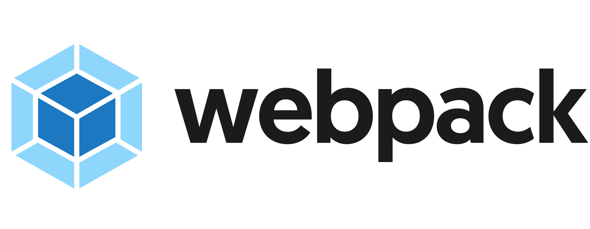
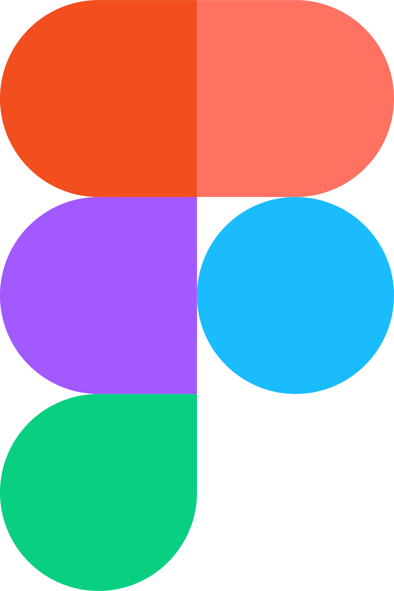

**Hi, I’m Semyon Evstigneev I am developer!**

**I am working with theese instruments**  

<code></code>
<code></code>
<code></code>
<code></code>
<code></code>
<code></code>
<code></code>
<code></code>
<code></code>
<code></code>
<code></code>
  

**📫 How to reach me ...** 

	
	
	

 
 

**Projects I contributed to**  
[lkk.moex.com](https://lkk.moex.com/)  
[cabinet.moex.com](https://cabinet.moex.com/)  
[school.moex.com](https://school.moex.com/)  
[pkk.rosreestr.ru/](https://pkk.rosreestr.ru/)  
[refueler.ru](https://refueler.ru/#/)  
[serval-cloud.ru](https://serval-cloud.ru/)  
[lk.serval-cloud.ru](https://lk.serval-cloud.ru/)  
[fcluch.ru/](https://fcluch.ru/)  
[pkk.rosreestr.ru/](https://pkk.rosreestr.ru/)  
[ikn.mkra.org/maps](https://ikn.mkra.org/maps/?type=0)  

**test assignments** 
[next + react + ts](https://sevser.github.io/KiwiTestAssignment/) 
[react + ts](https://sevser.github.io/bluesweaterstudio-test-assignment/) 
[vue3 + ts + indexdb](https://sevser.github.io/joinbrands_test_assgnment/) 
[ts + vue + node](https://github.com/Sevser/low-code) 
[ts + ws + vue](https://sevser.github.io/atlant_io/) 
[react + redux + ts](https://sevser.github.io/react-typescript-first-attempt/) 
[react + redux + googleMapsApi](https://sevser.github.io/test_task_kiko/) 

**My speeches**  
[ArcGIS widgets](https://www.youtube.com/watch?v=yx1UjblSYuo)  
