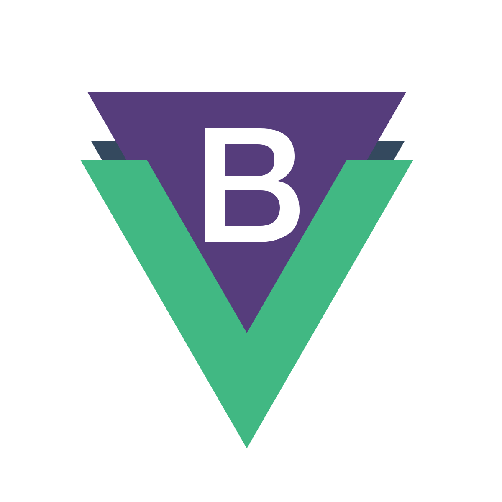

	
	
	

 
 
- 👋 Hi, I’m @Sevser 
- 👀 I’m interested in ... 
- 🌱 I’m currently learning ... 
- 💞️ I’m looking to collaborate on ... 
- 📫 How to reach me ...
  

**I am working with theese instruments**  

<code></code>
<code></code>
<code></code>
<code></code>
<code></code>
<code></code>
<code></code>
<code></code>
<code></code>
<code></code>
